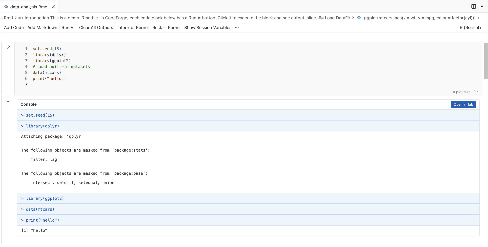
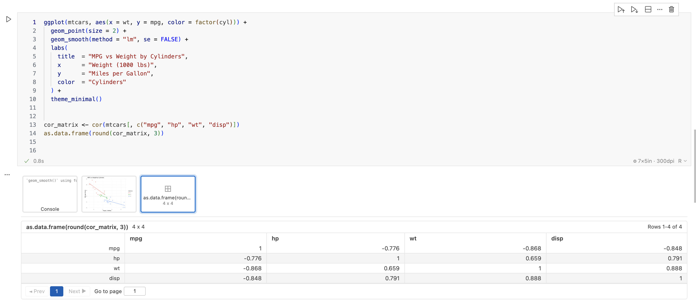
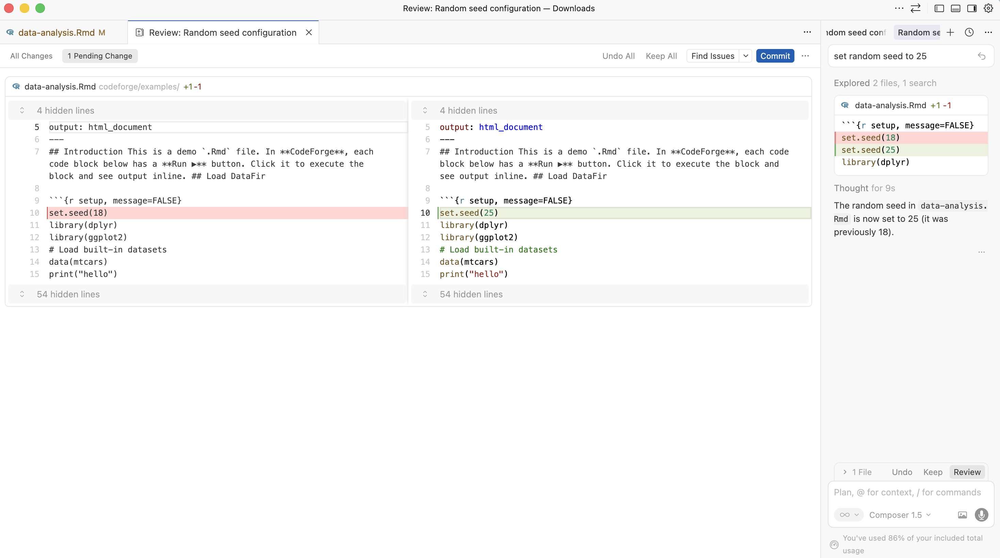
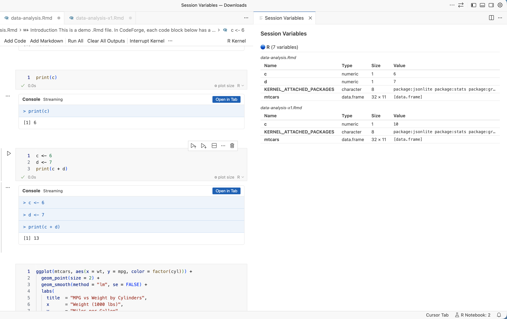

# R Notebook

R Notebook is a VSCode extension (https://marketplace.visualstudio.com/items?itemName=zitiansunsh1ne.r-notebook) for `.Rmd` and `.ipynb` workflows with inline execution, notebook-style outputs, plots, and session-aware tooling for day-to-day data science work.

## Features

- Native `.Rmd` and `.ipynb` support with inline execution and notebook controls
- Inline console output, plot rendering, and ordered multi-output display
- Session controls for selecting, restarting, and interrupting kernels
- Session variable inspection for active notebooks
- Multi-session support so separate notebooks can keep their own runtime state
- Paginated data-frame viewing for larger tabular outputs
- Built to work well alongside AI-assisted editing workflows

## AI Editing Support

R Notebook works well with AI-powered editing and review tools, including GitHub Copilot, Cursor, and Antigravity. You can keep an `.Rmd` notebook open, ask an AI tool to revise analysis code or documentation, and continue executing chunks with the same inline notebook experience. 

## Preview

### Notebook preview



### Inline viewing of output



### AI-assisted editing in Cursor



### Multi-session support



## Build From Source

```bash
npm install
npm run build
```

## Package

```bash
npm run package
```

Version `1.0.2` packages into the project root as `r-notebook-1.0.2.vsix`.
